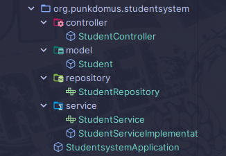

# Backend Folder Structure

## Estrutura
Primeiro vamos estruturar as nossas pastas a serem usadas e no package raiz do projeto teremos quatro pastas:
- controller
- model
- service
- repository

Logo o projeto ficara deste jeito:

## Explicação 
